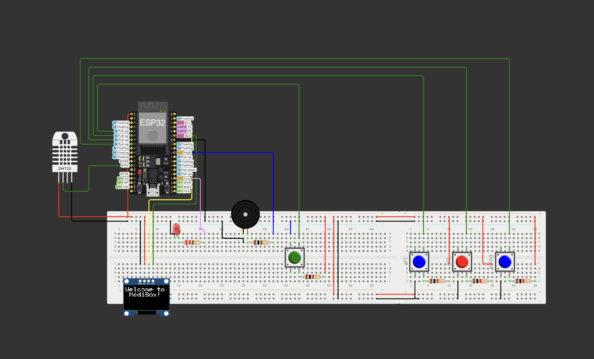
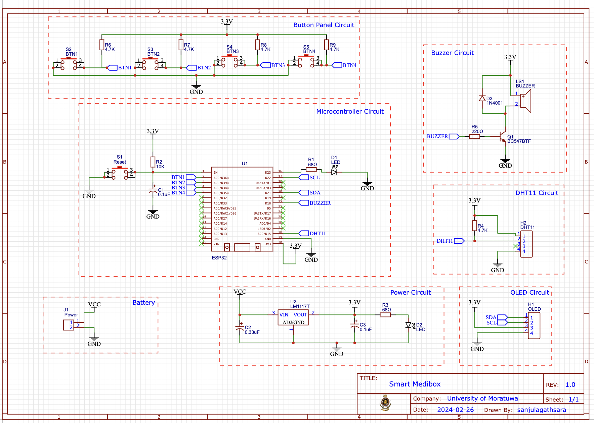
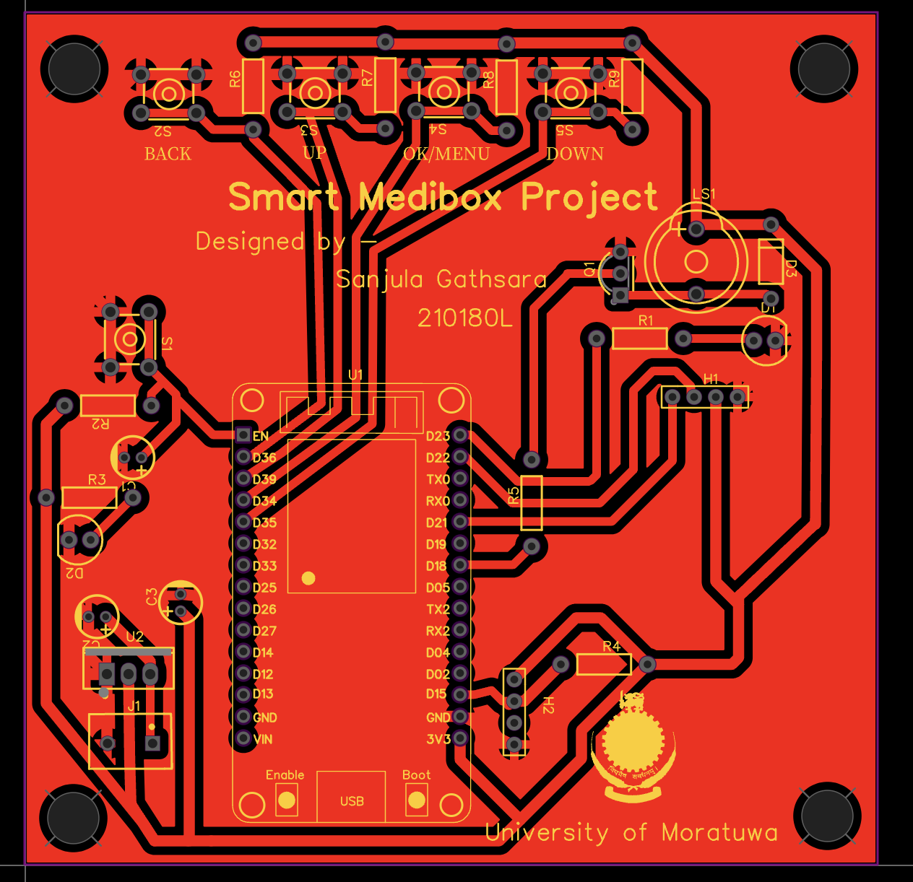
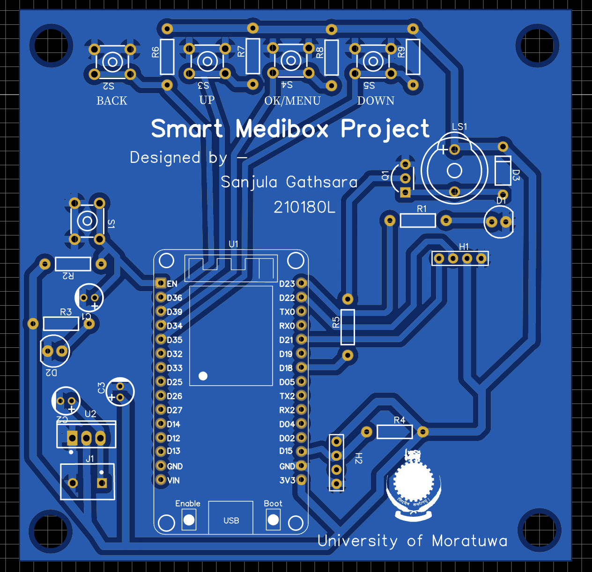

# MediBox Project

## Overview

MediBox is a smart medication reminder system designed to assist patients in taking their medications on time. The device uses an OLED display, a DHT sensor for temperature and humidity, and a buzzer for alarms. It connects to a WiFi network to synchronize time using an NTP server.

## Author

- **Name:** Gathsara J.A.S
- **Index Number:** 210180L

## Libraries

The following libraries are used in this project:

- `Wire.h`: I2C communication
- `Adafruit_GFX.h`: Graphics display
- `Adafruit_SSD1306.h`: OLED display
- `DHTesp.h`: DHT sensor
- `WiFi.h`: WiFi connection

## Hardware Components

- OLED Display (128x64 pixels)
- DHT22 Sensor
- Buzzer
- LEDs
- Push Buttons
- ESP32 Development Board

## Functionalities

1. **Time Synchronization**: Synchronizes time with an NTP server to ensure accurate timekeeping.
2. **Alarm System**: Sets multiple alarms to remind users to take their medications.
3. **Temperature and Humidity Monitoring**: Monitors and displays the temperature and humidity levels using the DHT22 sensor.
4. **User Interaction**: Allows users to set the time zone, configure alarms, and navigate through the menu using push buttons.
5. **Notifications**: Provides audible and visual notifications when it is time to take medication.

## Circuit Diagram

 
<em>Circuit Diagram<em/>

## Schematic Diagram

 
<em>Schematic Diagram<em/>

## PCB Layout

 
<em>PCB Layout<em/>

## 2D view

 
<em>2D view<em/>

## Printed Circuit Board

 
<em>PCB<em/>

## Usage

1. **Setup**:
   - Connect the hardware components as per the circuit schematic.
   - Upload the code to the ESP32 development board.
   - Power on the device.

2. **Connecting to WiFi**:
   - The device will automatically attempt to connect to the predefined WiFi network.
   - Ensure that the WiFi credentials in the code match your network details.

3. **Setting Time Zone**:
   - Navigate to the "Set Time Zone" mode using the push buttons.
   - Adjust the time zone by setting the hour and minute offsets.

4. **Setting Alarms**:
   - Navigate to the alarm settings mode.
   - Set the desired time for each alarm using the push buttons.

5. **Monitoring Temperature and Humidity**:
   - The device continuously monitors the temperature and humidity.
   - Alerts are displayed on the OLED screen if the temperature or humidity goes beyond predefined thresholds.

6. **Alarm Notifications**:
   - When an alarm is triggered, the buzzer will sound, and the LED will light up.
   - Press the cancel button to stop the alarm.

This device is a helpful tool for ensuring that medications are taken on time and for monitoring environmental conditions to store medications properly.
